```mermaid
flowchart LR
    A[📱 Meshtastic Devices] --> B[🔧 Built-in MQTT Broker]
    B --> C[🎯 Prometheus Hook]
    C --> D[📊 Metrics Endpoint]
    E[📈 Prometheus] --> D
    
    style A fill:#e1f5fe
    style B fill:#f3e5f5
    style C fill:#e8f5e8
    style D fill:#fff3e0
```

# Meshtastic [mochi-mqtt](https://github.com/mochi-mqtt/server) Plugin

[](https://github.com/capricornusx/meshtastic-mqtt-exporter/actions)
[](https://codecov.io/gh/capricornusx/meshtastic-mqtt-exporter)
[](https://goreportcard.com/report/github.com/capricornusx/meshtastic-mqtt-exporter)

A mochi-mqtt server plugin that exports Meshtastic device telemetry to Prometheus metrics.

## Features

- **Standalone mode**: Connect to external MQTT broker (for existing setups)
- **Embedded mode**: Built-in MQTT broker with Prometheus hook (recommended)
- **mochi-mqtt Hook**: Standalone hook for existing mochi-mqtt servers
- **Prometheus metrics**: Battery, temperature, humidity, pressure, signal quality
- **Authentication**: Support for multiple users and anonymous connections
- **State persistence**: Save/restore metrics between restarts

## Installation

### Pre-built Binaries

Download the latest release for your platform from [GitHub Releases](https://github.com/capricornusx/meshtastic-mqtt-exporter/releases).

### Build from Source

```bash
git clone https://github.com/capricornusx/meshtastic-mqtt-exporter
cd meshtastic-mqtt-exporter
go mod download
```

### Building for Raspberry Pi

```bash
# Build for all Raspberry Pi variants
make build-rpi

# Or build specific versions:
make build-rpi-arm64  # Pi 4/5 (64-bit)
make build-rpi-arm32  # Older Pi (32-bit)
```

## Usage

### Embedded Mode (Recommended)

```bash
go run ./cmd/embedded-hook --config config.yaml
```

### Standalone Mode

```bash
go run ./cmd/standalone --config config.yaml
```

### As mochi-mqtt Hook

```go
import "meshtastic-exporter/pkg/hooks"

// Add to your existing mochi-mqtt server
hook := hooks.NewMeshtasticHook(hooks.MeshtasticHookConfig{
PrometheusAddr: ":8100",
EnableHealth:   true,
})
server.AddHook(hook, nil)
```

See [example](examples/mochi-mqtt-integration/README.md) for complete integration.

## Mode Comparison

| Feature         | Embedded Mode              | Standalone Mode               |
|-----------------|----------------------------|-------------------------------|
| **Setup**       | Single binary              | Requires external MQTT broker |
| **Performance** | Higher (direct processing) | Lower (network overhead)      |
| **Resources**   | Lower                      | Higher                        |
| **Use Case**    | New deployments            | Existing MQTT infrastructure  |
| **Recommended** | ✅ Yes                      | For legacy setups             |

## Configuration

See [Configuration Guide](docs/CONFIGURATION.md) for detailed options.

## Docker Deployment

See docs/ for container deployment with health checks.

Basic example:

```yaml
mqtt:
  host: localhost
  port: 1883
  allow_anonymous: true

prometheus:
  enabled: true
  port: 8100
  metrics_ttl: "30m"  # Clean up stale metrics after 30 minutes

state:
  enabled: true
  file: "meshtastic_state.json"
```

## Metrics

- `meshtastic_messages_total` - Total messages by type
- `meshtastic_battery_level_percent` - Battery level
- `meshtastic_temperature_celsius` - Temperature
- `meshtastic_humidity_percent` - Humidity
- `meshtastic_pressure_hpa` - Barometric pressure
- `meshtastic_rssi_dbm` - Signal strength
- `meshtastic_mqtt_up` - MQTT connection status
- `meshtastic_node_last_seen_timestamp` - Last seen timestamp

## Architecture

### Embedded Mode (Recommended)



### Standalone Mode



```mermaid
flowchart LR
    A[📱 Meshtastic Devices] --> B[🌐 External MQTT Broker]
    B --> C[🔌 MQTT Client]
    C --> D[⚙️ Exporter]
    D --> E[📊 Metrics Endpoint]
    F[📈 Prometheus] --> E
    
    style A fill:#e1f5fe
    style B fill:#ffebee
    style C fill:#f3e5f5
    style D fill:#e8f5e8
    style E fill:#fff3e0
```

### Data Flow


### TODO:
 - [ ] 💯 Add support for all sensor types from [telemetry.proto](https://github.com/meshtastic/protobufs/blob/master/meshtastic/telemetry.proto)
 - [ ] ♻ Auto-release (sync) on upstream .proto 👆 changes 
 - [ ] 📊 Create an example Grafana dashboard
 - [ ] 🔥 Create basic AlertManager rules

## Acknowledgments

Built using the excellent [mochi-mqtt](https://github.com/mochi-mqtt/server) MQTT broker by [@mochi-co](https://github.com/mochi-co).

## License

MIT License
